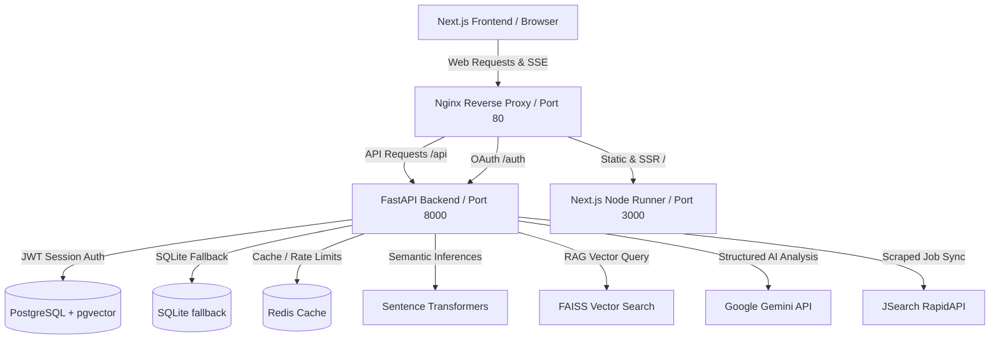

# SainikNext AI - Architecture Diagram & Subsystems

This document describes the technical architecture and subsystems of **SainikNext AI**, an AI-powered career transition platform designed for Indian Army veterans.

## Overview Diagram

The following Mermaid diagram illustrates the data flow and communication pathways between client devices, the reverse proxy, backend microservices, vector search index, database layers, and external APIs.

---

## Subsystem Details

### 1. Frontend: Next.js (App Router)
- **Role**: Provides the user interface, sidebar navigation, dynamic layout management, session storage, and SSE streaming parsing.
- **Key Modules**:
  - `ClientLayoutWrapper`: Performs connection health checks to `/health` and monitors global session state.
  - `ProtectedSidebar`: Manages internal app router navigation (Dashboard, Career Coach, Resume Builder, Career Explorer, Roadmap).
  - `Career Coach`: Consumes text/event-stream chunks via stream readers, displaying metadata in RAG boxes and conversational outputs.

### 2. Backend Gateway: FastAPI
- **Role**: Serves all JSON payloads, orchestrates background worker cycles, handles JWT verification, and streams SSE chunks.
- **Key Modules**:
  - `main.py`: Bootstraps route handlers, registers OAuth hooks, handles rate-limiting (`slowapi`), and loads lifespan managers.

### 3. AI Services: Google Gemini
- **Role**: Orchestrates natural language translation, RAG summarization, resume generation, and step-by-step roadmap compiling.
- **Client**: Native `google-genai` SDK (`from google import genai`).

### 4. Vector Search & Embedding: Sentence Transformers & FAISS
- **Role**: Provides semantic matches mapping military roles to civilian job targets.
- **Model**: `all-MiniLM-L6-v2` (384-dimensional dense vectors).
- **Index**: Flat L2 FAISS index loaded inside `CareerMatcher`.

### 5. Persistent & Cache Layers
- **Database**: PostgreSQL (for production) with sqlite fallback. Schema includes auto-upgrading migration commands on application startup.
- **Cache**: Redis client wrapper with memory-based fallback if Redis is unavailable.
